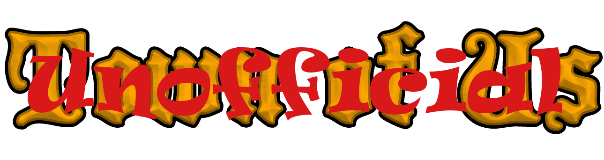

## *Note: This repository is an unofficial continuation of Town of Us R

An Among Us mod that adds a bunch of roles, modifiers and game settings

Join our [Discord](https://discord.gg/ugyc4EVUYZ) if you have any problems or want to find people to play with!

| **Impostor Roles**           | **Crewmate Roles**                | **Neutral Roles**                | **Modifiers**                |
|:----------------------------:|:---------------------------------:|:--------------------------------:|:----------------------------:|
| [Blackmailer](#blackmailer)  | [Altruist](#altruist)             | [Amnesiac](#amnesiac)            | [Aftermath](#aftermath)      |
| [Bomber](#bomber)            | [Aurial](#aurial)                 | [Arsonist](#arsonist)            | [Bait](#bait)                |
| [Eclipsal](#eclipsal)        | [Cleric](#cleric)                 | [Foreteller](#foreteller)        | [Button Barry](#button-barry)|
| [Escapist](#escapist)        | [Deputy](#deputy)                 | [Executioner](#executioner)      | [Celebrity](#celebrity)      |
| [Grenadier](#grenadier)      | [Detective](#detective)           | [Glitch](#glitch)                | [Diseased](#diseased)        |
| [Hypnotist](#hypnotist)      | [Engineer](#engineer)             | [Guardian Angel](#guardian-angel)| [Disperser](#disperser)      |
| [Janitor](#janitor)          | [Haunter](#haunter)               | [Jester](#jester)                | [Double Shot](#double-shot)  |
| [Miner](#miner)              | [Hunter](#hunter)                 | [Juggernaut](#juggernaut)        | [Flash](#flash)              |
| [Morphling](#morphling)      | [Imitator](#imitator)             | [Mercenary](#mercenary)          | [Frosty](#frosty)            |
| [Scavenger](#scavenger)      | [Investigator](#investigator)     | [Phantom](#phantom)              | [Giant](#giant)              |
| [Swooper](#swooper)          | [Jailor](#jailor)                 | [Plaguebearer](#plaguebearer)    | [Immovable](#immovable)      |
| [Traitor](#traitor)          | [Lookout](#lookout)               | [Soul Collector](#soul-collector)| [Lovers](#lovers)            |
| [Undertaker](#undertaker)    | [Medic](#medic)                   | [Survivor](#survivor)            | [Mini](#mini)                |
| [Venerer](#venerer)          | [Medium](#medium)                 | [Vampire](#vampire)              | [Multitasker](#multitasker)  |
| [Warlock](#warlock)          | [Mystic](#mystic)                 | [Werewolf](#werewolf)            | [Radar](#radar)              |
| [Wraith](#wraith)            | [Oracle](#oracle)                 | [Icenberg](#icenberg)            | [Saboteur](#saboteur)        |
|                              | [Plumber](#plumber)               |                                  | [Satellite](#satellite)      |
|                              | [President](#president)           |                                  | [Shy](#shy)                  |
|                              | [Prosecutor](#prosecutor)         |                                  | [Sixth Sense](#sixth-sense)  |
|                              | [Seer](#seer)                     |                                  | [Sleuth](#sleuth)            |
|                              | [Sheriff](#sheriff)               |                                  | [Taskmaster](#taskmaster)    |
|                              | [Snitch](#snitch)                 |                                  | [Tiebreaker](#tiebreaker)    |
|                              | [Spy](#spy)                       |                                  | [Torch](#torch)              |
|                              | [Swapper](#swapper)               |                                  | [Underdog](#underdog)        |
|                              | [Tracker](#tracker)               |                                  |                              |
|                              | [Trapper](#trapper)               |                                  |                              |
|                              | [Transporter](#transporter)       |                                  |                              |
|                              | [Veteran](#veteran)               |                                  |                              |
|                              | [Vigilante](#vigilante)           |                                  |                              |
|                              | [Warden](#warden)                 |                                  |                              |
-----------------------
# Releases
| Among Us - Version| Mod Version | Link |
|----------|-------------|-----------------|
| 16.0.2s & 16.0.2e | v1.0.6 | [Download](https://github.com/badzyn/Town-Of-Us-Unofficial/releases/download/v1.0.1/ToU-Unofficial-v1.0.6.zip) |
| 16.0.2s & 16.0.2e | v1.0.5 | [Download](https://github.com/badzyn/Town-Of-Us-Unofficial/releases/download/v1.0.1/ToU-Unofficial-v1.0.5.zip) |
| 16.0.2s & 16.0.2e | v1.0.4 | [Download](https://github.com/badzyn/Town-Of-Us-Unofficial/releases/download/v1.0.1/ToU-Unofficial-v1.0.4.zip) |
| 16.0.2s & 16.0.2e | v1.0.3 | [Download](https://github.com/badzyn/Town-Of-Us-Unofficial/releases/download/v1.0.1/ToU-Unofficial-v1.0.3.zip) |
| 16.0.2s & 16.0.2e | v1.0.2 | [Download](https://github.com/badzyn/Town-Of-Us-Unofficial/releases/download/v1.0.1/ToU-Unofficial-v1.0.2.zip) |
| 16.0.2s & 16.0.2e | v1.0.1 | [Download](https://github.com/badzyn/Town-Of-Us-Unofficial/releases/download/v1.0.1/ToU-Unofficial-v1.0.1.zip) |
| 16.0.2s & 16.0.2e | v1.0.0 | [Download](https://github.com/badzyn/Town-Of-Us-Unofficial/releases/download/v1.0.0/TownOfUs.dll) |

  
 Changelog 

  

  
 v5.3.1 

  <ul> <li>Reordered the colours again to fix Better Crew Link issues</li> </ul>
  <ul> <li>Fixed an issue of Radar Arrow sometimes not appearing</li> </ul>
  <ul> <li>Fixed some chat command issues, courtesy of @chloe-gpt</li> </ul>
  

  

The Plaguebearer is a Neutral role with its own win condition, as well as an ability to transform into another role.\
The Plaguebearer has one ability, which allows them to infect other players.\
Once infected, the infected player can go and infect other players via interacting with them.\
Once all players are infected, the Plaguebearer becomes Pestilence.\
The Pestilence is a unkillable force which can only be killed by being voted out, even their lover dying won't kill them.\
The Plaguebearer or Pestilence needs to be the last killer alive to win the game.
### Game Options
| Name | Description | Type | Default |
|----------|:-------------:|:------:|:------:|
| Plaguebearer | The percentage probability of the Plaguebearer appearing | Percentage | 0% |
| Infect Cooldown | The cooldown of the Plaguebearer's Infect button | Time | 25s |
| Pestilence Kill Cooldown | The cooldown of the Pestilence's Kill button | Time | 25s |
| Pestilence can Vent | Whether the Pestilence can Vent | Toggle | False |

-----------------------
## Soul Collector
### **Team: Neutral**
The Soul Collector is a Neutral role with its own win condition.\
The Soul Collector kills be reaping players, reaped players do not leave behind a dead body,\
instead they leave a soul.\
The Soul Collector needs to be the last killer alive to win the game.
### Game Options
| Name | Description | Type | Default |
|----------|:-------------:|:------:|:------:|
| Soul Collector | The percentage probability of the Soul Collector appearing | Percentage | 0% |
| Reap Cooldown | The Cooldown of the Soul Collector's Reap button | Time | 25s |
| Soul Collector can Vent | Whether the Soul Collector can Vent | Toggle | False |

-----------------------
## Vampire
### **Team: Neutral**

The Vampire is a Neutral role with its own win condition.\
The Vampire can convert or kill other players by biting them.\
If the bitten player was a Crewmate they will turn into a Vampire (unless there are 2 Vampires alive)\
Else they will kill the bitten player.
### Game Options
| Name | Description | Type | Default |
|----------|:-------------:|:------:|:------:|
| Vampire | The percentage probability of the Vampire appearing | Percentage | 0% |
| Bite Cooldown | The cooldown of the Vampire's Bite button | Time | 25s |
| Vampire Has Impostor Vision | Whether the Vampire Has Impostor Vision | Toggle | False |
| Vampire Can Vent | Whether the Vampire Can Vent | Toggle | False |
| New Vampire Can Assassinated | Whether the new Vampire can assassinate | Toggle | False |
| Maximum Vampires Per Game | The maximum amount of players that can be Vampires | Number | 2 |
| Can Convert Neutral Benign Roles | Whether Neutral Benign Roles can be turned into Vampires | Toggle | False |
| Can Convert Neutral Evil Roles | Whether Neutral Evil Roles can be turned into Vampires | Toggle | False |

-----------------------
## Werewolf
### **Team: Neutral**

The Werewolf is a Neutral role with its own win condition.\
Although the Werewolf has a kill button, they can't use it unless they are Rampaged.\
Once the Werewolf rampages they gain Impostor vision and the ability to kill.\
However, unlike most killers their kill cooldown is really short.\
The Werewolf needs to be the last killer alive to win the game.
### Game Options
| Name | Description | Type | Default |
|----------|:-------------:|:------:|:------:|
| Werewolf | The percentage probability of the Werewolf appearing | Percentage | 0% |
| Rampage Cooldown | The cooldown of the Werewolf's Rampage button | Time | 25s |
| Rampage Duration | The duration of the Werewolf's Rampage | Time | 25s |
| Rampage Kill Cooldown | The cooldown of the Werewolf's Kill button | Time | 10s |
| Werewolf can Vent when Rampaged | Whether the Werewolf can Vent when Rampaged | Toggle | False |

-----------------------
# Impostor Roles
## Eclipsal
### **Team: Impostors**

The Eclipsal is an Impostor that can blind other players.\
Blinded players have no vision and their report buttons do not light up (but can still be used).

### Game Options
| Name | Description | Type | Default |
|----------|:-------------:|:------:|:------:|
| Eclipsal | The percentage probability of the Eclipsal appearing | Percentage | 0% |
| Blind Cooldown | The cooldown of the Eclipsal's Blind button | Time | 25s |
| Blind Duration | How long the Blind lasts for | Time | 25s |
| Blind Radius | How wide the blind radius is | Multiplier | 1x |

-----------------------
## Escapist
### **Team: Impostors**

The Escapist is an Impostor that can teleport to a different location.\
Once per round the Escapist can Mark a location which they can then escape to later in the round.

### Game Options
| Name | Description | Type | Default |
|----------|:-------------:|:------:|:------:|
| Escapist | The percentage probability of the Escapist appearing | Percentage | 0% |
| Recall Cooldown | The cooldown of the Escapist's Recall button | Time | 25s |
| Escapist can Vent | Whether the Escapist can Vent | Toggle | False |

-----------------------
## Grenadier
### **Team: Impostors**

The Grenadier is an Impostor that can throw smoke grenades.\
During the game, the Grenadier has the option to throw down a smoke grenade which blinds crewmates so they can't see.\
However, a sabotage and a smoke grenade can not be active at the same time.

### Game Options
| Name | Description | Type | Default |
|----------|:-------------:|:------:|:------:|
| Grenadier | The percentage probability of the Grenadier appearing | Percentage | 0% |
| Flash Grenade Cooldown | The cooldown of the Grenadier's Flash button | Time | 25s |
| Flash Grenade Duration | How long the Flash Grenade lasts for | Time | 10s |
| Flash Radius | How wide the flash radius is | Multiplier | 1x |
| Grenadier can Vent | Whether the Grenadier can Vent | Toggle | False |
-----------------------
## Morphling
### **Team: Impostors**

The Morphling is an Impostor that can Morph into another player.\
At the beginning of the game and after every meeting, they can choose someone to Sample.\
They can then Morph into that person at any time for a limited amount of time.

### Game Options
| Name | Description | Type | Default |
|----------|:-------------:|:------:|:------:|
| Morphling | The percentage probability of the Morphling appearing | Percentage | 0% |
| Morph Cooldown | The cooldown of the Morphling's Morph button | Time | 25s |
| Morph Duration | How long the Morph lasts for | Time | 10s |
| Morphling can Vent | Whether the Morphling can Vent | Toggle | False |

-----------------------
## Swooper
### **Team: Impostors**

The Swooper is an Impostor that can temporarily turn invisible.

### Game Options
| Name | Description | Type | Default |
|----------|:-------------:|:------:|:------:|
| Swooper | The percentage probability of the Swooper appearing | Percentage | 0% |
| Swooper Cooldown | The cooldown of the Swooper's Swoop button | Time | 25s |
| Swooper Duration | How long the Swooping lasts for | Time | 10s |
| Swooper can Vent | Whether the Swooper can Vent | Toggle | False |

-----------------------
## Venerer
### **Team: Impostors**

The Venerer is an Impostor that gains abilities through killing.\
After their first kill, the Venerer can camouflage themself.\
After their second kill, the Venerer can sprint.\
After their third kill, every other player is slowed while their ability is activated.\
All abilities are activated by the one button and have the same duration.

### Game Options
| Name | Description | Type | Default |
|----------|:-------------:|:------:|:------:|
| Venerer | The percentage probability of the Venerer appearing | Percentage | 0% |
| Ability Cooldown | The cooldown of the Venerer's Ability button | Time | 25s |
| Ability Duration | How long the Venerer's ability lasts for | Time | 10s |
| Sprint Speed | How fast the speed increase of the Venerer is when sprinting | Multiplier | 1.25x |
| Min Freeze Speed | How slow the minimum speed is when the Venerer's ability is active | Multiplier | 0.25x |
| Freeze Radius | How wide the freeze radius is | Multiplier | 1x |

-----------------------
## Wraith
### **Team Impostors**
Wraith is an impostor that can pass through walls.

### Game Options
| Name | Description | Type | Default |
|----------|:-------------:|:------:|:------:|
| Wraith | The percentage probability of the Wraith appearing | Percentage | 0% |
| Wraith Cooldown | The cooldown of the Wraith Ability button | Time | 25s |
| Wraith Duration | How long the Wraith can pass trought wall | Time | 10s |
| Wraith Can Vent | Whether the Wraith can vent | Toggle | False |

-----------------------
## Bomber
### **Team: Impostors**

The Bomber is an Impostor who has the ability to plant bombs instead of kill.\
After a bomb is planted, the bomb will detonate a fixed time period as per settings.\
Once the bomb detonates it will kill all crewmates (and Impostors!) inside the radius.

### Game Options
| Name | Description | Type | Default |
|----------|:-------------:|:------:|:------:|
| Bomber | The percentage probability of the Bomber appearing | Percentage | 0% |
| Detonate Delay | The delay of the detonation after bomb has been planted | Time | 5s |
| Max Kills In Detonation | Maximum number of kills in the detonation | Time | 5s |
| Detonate Radius | How wide the detonate radius is | Multiplier | 0.25x |
| Bomber can Vent | Whether the Bomber can Vent | Toggle | False |
| All Imps See Bomb | Whether all the Impostors see the Bomber's bombs | Toggle | False |

-----------------------
## Scavenger
### **Team: Impostors**

The Scavenger is an Impostor who hunts down prey.\
With each successful hunt the Scavenger has a shortened kill cooldown.\
On an incorrect kill the Scavenger has a significantly increased kill cooldown.

### Game Options
| Name | Description | Type | Default |
|----------|:-------------:|:------:|:------:|
| Scavenger | The percentage probability of the Scavenger appearing | Percentage | 0% |
| Scavenge Duration | How long the Scavenger's scavenge lasts for | Time | 25s |
| Scavenge Duration Increase Per Kill | How much time the Scavenge duration increases on a correct kill | Time | 10s |
| Scavenge Kill Cooldown On Correct Kill | The kill cooldown the Scavenger has on a correct kill | Time | 10s |
| Kill Cooldown Multiplier On Incorrect Kill | The increased time the kill cooldown has on an incorrect kill | Multiplier | 3x |

-----------------------
## Traitor
### **Team: Impostors**

If all Impostors die before a certain point in the game, a random crewmate is selected to become the Traitor.\
The Traitor has no additional abilities and their job is simply to avenge the dead Impostors.\
Once this player has turned into the Traitor their alliance sits with the Impostors.\
The Traitor is offered a choice of up to 3 Impostor roles when they initially change roles.

### Game Options
| Name | Description | Type | Default |
|----------|:-------------:|:------:|:------:|
| Traitor | The percentage probability of the Traitor appearing | Percentage | 0% |
| Minimum People Alive When Traitor Can Spawn | The minimum number of people alive when a Traitor can spawn | Number | 5 |
| Traitor Won't Spawn if Neutral Killing are Alive | Whether the Traitor won't spawn if any Neutral Killing roles are alive | Toggle | False |

-----------------------
## Warlock
### **Team: Impostors**

The Warlock is an Impostor that can charge up their kill button.\
Once activated the Warlock can use their kill button infinitely until they run out of charge.\
However, they do not need to fully charge their kill button to use it.

### Game Options
| Name | Description | Type | Default |
|----------|:-------------:|:------:|:------:|
| Warlock | The percentage probability of the Warlock appearing | Percentage | 0% |
| Time It Takes To Fully Charge | The time it takes to fully charge the Warlock's Kill Button | Time | 25s |
| Time It Takes To Use Full Charge | The maximum duration a charge of the Warlock's Kill Button lasts | Time | 1s |

-----------------------
## Blackmailer
### **Team: Impostors**
The Blackmailer is an Impostor that can silence people in meetings.\
During each round, the Blackmailer can go up to someone and blackmail them.\
This prevents the blackmailed person from speaking and possibly voting during the next meeting.

### Game Options
| Name | Description | Type | Default |
|----------|:-------------:|:------:|:------:|
| Blackmailer | The percentage probability of the Blackmailer appearing | Percentage | 0% |
| Initial Blackmail Cooldown | The initial cooldown of the Blackmailer's Blackmail button | Time | 10s |
| Only Target Sees Blackmail | If enabled, only the blackmailed player (and the Blackmailer) will see that the player can't speak | Toggle | False |
| Maximum People Alive Where Blackmailed Can Vote | The maximum number of players alive to allow the blackmailed player to vote | Number | 5 |

-----------------------
## Hypnotist
### **Team: Impostors**
The Hypnotist is an Impostor that can hypnotize people.\
Once enough people are hypnotized, the Hypnotist can release Mass Hysteria.\
With Mass Hysteria released, all hypnotized players see all other players as either themselves, camouflaged or invisible.\
Once the Hypnotist dies Mass Hysteria is removed and people can see everyone normally again.

### Game Options
| Name | Description | Type | Default |
|----------|:-------------:|:------:|:------:|
| Hypnotist | The percentage probability of the Hypnotist appearing | Percentage | 0% |
| Hypnotize Cooldown | The cooldown of the Hypnotist's Hypnotize button | Time | 25s |

-----------------------
## Janitor
### **Team: Impostors**
The Janitor is an Impostor that can clean up bodies.\
Both their Kill and Clean ability have a shared cooldown, meaning they have to choose which one they want to use.

### Game Options
| Name | Description | Type | Default |
|----------|:-------------:|:------:|:------:|
| Janitor | The percentage probability of the Janitor appearing | Percentage | 0% |

-----------------------
## Miner
### **Team: Impostors**

The Miner is an Impostor that can create new vents.\
These vents only connect to each other, forming a new passway.

### Game Options
| Name | Description | Type | Default |
|----------|:-------------:|:------:|:------:|
| Miner | The percentage probability of the Miner appearing | Percentage | 0% |
| Mine Cooldown | The cooldown of the Miner's Mine button | Time | 25s |

-----------------------
## Undertaker
### **Team: Impostors**

The Undertaker is an Impostor that can drag and drop bodies.

### Game Options
| Name | Description | Type | Default |
|----------|:-------------:|:------:|:------:|
| Undertaker | The percentage probability of the Undertaker appearing | Percentage | 0% |
| Undertaker Drag Cooldown | The cooldown of the Undertaker Drag ability | Time | 25s |
| Undertaker Speed While Dragging | How fast the Undertaker moves while dragging a body in comparison to normal | Multiplier | 0.75x |
| Undertaker can Vent | Whether the Undertaker can Vent | Toggle | False |
| Undertaker can Vent while Dragging | Whether the Undertaker can Vent when they are Dragging a Body | Toggle | False |

-----------------------

# Modifiers
Modifiers are added on top of players' roles.
## Aftermath
### **Applied to: Crewmates**
Killing the Aftermath forces their killer to use their ability (if they have one and it's not in use).
### Game Options
| Name | Description | Type | Default |
|----------|:-------------:|:------:|:------:|
| Aftermath | The percentage probability of the Aftermath appearing | Percentage | 0% |

-----------------------
## Bait
### **Applied to: Crewmates**
Killing the Bait makes the killer auto self-report.
### Game Options
| Name | Description | Type | Default |
|----------|:-------------:|:------:|:------:|
| Bait | The percentage probability of the Bait appearing | Percentage | 0% |
| Bait Minimum Delay | The minimum time the killer of the Bait reports the body | Time | 0s |
| Bait Maximum Delay | The maximum time the killer of the Bait reports the body | Time | 1s |

-----------------------
## Celebrity
### **Applied to: Crewmates**
The Celebrity announces how, when and where they died the meeting after they die.
### Game Options
| Name | Description | Type | Default |
|----------|:-------------:|:------:|:------:|
| Celebrity | The percentage probability of the Celebrity appearing | Percentage | 0% |

-----------------------
## Diseased
### **Applied to: Crewmates**
Killing the Diseased increases the killer's kill cooldown.
### Game Options
| Name | Description | Type | Default |
|----------|:-------------:|:------:|:------:|
| Diseased | The percentage probability of the Diseased appearing | Percentage | 0% |
| Kill Multiplier | How much the Kill Cooldown of the Impostor is increased by | Multiplier | 3x |

-----------------------
## Frosty
### **Applied to: Crewmates**
Killing the Frosty slows the killer for a short duration.
### Game Options
| Name | Description | Type | Default |
|----------|:-------------:|:------:|:------:|
| Frosty | The percentage probability of the Frosty appearing | Percentage | 0% |
| Chill Duration | The duration of the chill after killing the Frosty | Time | 10s |
| Chill Start Speed | The start speed of the chill after killing the Frosty | Multiplier | 0.75x |

-----------------------
## Multitasker
### **Applied to: Crewmates**
The Multitasker's tasks are transparent.
### Game Options
| Name | Description | Type | Default |
|----------|:-------------:|:------:|:------:|
| Multitasker | The percentage probability of the Multitasker appearing | Percentage | 0% |

-----------------------
## Taskmaster
### **Applied to: Crewmates**
The Taskmaster completes a random task on the completion of each meeting.
### Game Options
| Name | Description | Type | Default |
|----------|:-------------:|:------:|:------:|
| Taskmaster | The percentage probability of the Taskmaster appearing | Percentage | 0% |

-----------------------
## Torch
### **Applied to: Crewmates**
The Torch's vision doesn't get reduced when the lights are sabotaged.
### Game Options
| Name | Description | Type | Default |
|----------|:-------------:|:------:|:------:|
| Torch | The percentage probability of the Torch appearing | Percentage | 0% |

-----------------------
## Button Barry
### **Applied to: All**
Button Barry has the ability to call a meeting from anywhere on the map, even during sabotages.
They have the same amount of meetings as a regular player.
### Game Options
| Name | Description | Type | Default |
|----------|:-------------:|:------:|:------:|
| Button Barry | The percentage probability of Button Barry appearing | Percentage | 0% |

-----------------------
## Flash
### **Applied to: All**
The Flash travels at a faster speed in comparison to a normal player.
### Game Options
| Name | Description | Type | Default |
|----------|:-------------:|:------:|:------:|
| Flash | The percentage probability of the Flash appearing | Percentage | 0% |
| Speed | How fast the Flash moves in comparison to normal | Multiplier | 1.25x |

-----------------------
## Giant
### **Applied to: All**
The Giant is a gigantic Crewmate, that has a decreased walk speed.
### Game Options
| Name | Description | Type | Default |
|----------|:-------------:|:------:|:------:|
| Giant | The percentage probability of the Giant appearing | Percentage | 0% |
| Speed | How fast the Giant moves in comparison to normal | Multiplier | 0.75x |

-----------------------
## Immovable
### **Applied to: All**
The Immovable cannot be moved by meetings, transports and disperse.
### Game Options
| Name | Description | Type | Default |
|----------|:-------------:|:------:|:------:|
| Immovable | The percentage probability of the Immovable appearing | Percentage | 0% |

-----------------------
## Lovers
### **Applied to: All**
The Lovers are two players who are linked together.\
These two players get picked randomly between Crewmates and Impostors.\
They gain the primary objective to stay alive together.\
If they are both among the last 3 players, they win.\
In order to do so, they gain access to a private chat, only visible by them in between meetings.\
However, they can also win with their respective team, hence why the Lovers do not know the role of the other lover.

### Game Options
| Name | Description | Type | Default |
|----------|:-------------:|:------:|:------:|
| Lovers | The percentage probability of the Lovers appearing | Percentage | 0% |
| Both Lovers Die | Whether the other Lover automatically dies if the other does | Toggle | True |
| Loving Impostor Probability | The chances of one lover being an Impostor | Percentage | 20% |
| Neutral Roles Can Be Lovers | Whether a Lover can be a Neutral Role | Toggle | True |
| Impostor Lover Can Kill Teammate | Whether an Impostor Lover can kill another Impostor | Toggle | False |

-----------------------
## Mini
### **Applied to: All**
The Mini is a tiny Crewmate.
### Game Options
| Name | Description | Type | Default |
|----------|:-------------:|:------:|:------:|
| Mini | The percentage probability of the Mini appearing | Percentage | 0% |

-----------------------
## Radar
### **Applied to: All**
The Radar is a crewmate who knows where the closest player is to them.
### Game Options
| Name | Description | Type | Default |
|----------|:-------------:|:------:|:------:|
| Radar | The percentage probability of the Radar appearing | Percentage | 0% |

-----------------------
## Satellite
### **Applied to: All**
The Satellite has a 1 time use ability to detect all dead bodies.
### Game Options
| Name | Description | Type | Default |
|----------|:-------------:|:------:|:------:|
| Satellite | The percentage probability of the Satellite appearing | Percentage | 0% |
| Broadcast Duration | The duration of the broadcast arrows | Time | 10s |

-----------------------
## Shy
### **Applied to: All**
The Shy becomes transparent when standing still for a short duration.
### Game Options
| Name | Description | Type | Default |
|----------|:-------------:|:------:|:------:|
| Shy | The percentage probability of the Shy appearing | Percentage | 0% |
| Transparency Delay | The delay until the Shy starts turning transparent | Time | 5s |
| Turn Transparent Duration | The duration of the Shy turning transparent | Time | 5s |
| Final Opacity | The final opacity level of the Shy | Percentage | 20% |

-----------------------
## Sixth Sense
### **Applied to: All**
The Sixth Sense is a crewmate who can see who interacts with them.
### Game Options
| Name | Description | Type | Default |
|----------|:-------------:|:------:|:------:|
| Sixth Sense | The percentage probability of the Sixth Sense appearing | Percentage | 0% |

-----------------------
## Sleuth
### **Applied to: All**
The Sleuth is a crewmate who gains knowledge from reporting dead bodies.\
During meetings the Sleuth can see the roles of all players in which they've reported.
### Game Options
| Name | Description | Type | Default |
|----------|:-------------:|:------:|:------:|
| Sleuth | The percentage probability of the Sleuth appearing | Percentage | 0% |

-----------------------
## Tiebreaker
### **Applied to: All**
If any vote is a draw, the Tiebreaker's vote will go through.\
If they voted another player, they will get voted out.
### Game Options
| Name | Description | Type | Default |
|----------|:-------------:|:------:|:------:|
| Tiebreaker | The percentage probability of the Tiebreaker appearing | Percentage | 0% |

-----------------------
## Disperser
### **Applied to: Impostors**
The Disperser is an Impostor who has a 1 time use ability to send all players to a random vent.\
This includes miner vents.\
Does not appear on Airship or Submerged.
### Game Options
| Name | Description | Type | Default |
|----------|:-------------:|:------:|:------:|
| Disperser | The percentage probability of the Disperser appearing | Percentage | 0% |

-----------------------
## Double Shot
### **Applied to: Impostors**
Double Shot is an Impostor who gets an extra life when assassinating.\
Once they use their life they are indicated with a red flash\
and can no longer guess the person who they guessed wrong for the remainder of that meeting.
### Game Options
| Name | Description | Type | Default |
|----------|:-------------:|:------:|:------:|
| Double Shot| The percentage probability of Double Shot appearing | Percentage | 0% |

-----------------------
## Saboteur
### **Applied to: Impostors**

The Saboteur is an Impostor with a passive sabotage cooldown reduction.

### Game Options
| Name | Description | Type | Default |
|----------|:-------------:|:------:|:------:|
| Saboteur | The percentage probability of the Saboteur appearing | Percentage | 0% |
| Reduced Sabotage Bonus | The amount of time removed from the Saboteur's sabotage cooldowns | Time | 10s |

-----------------------
## Underdog
### **Applied to: Impostors**

The Underdog is an Impostor with a prolonged kill cooldown.\
When they are the only remaining Impostor, they will have their kill cooldown shortened.

### Game Options
| Name | Description | Type | Default |
|----------|:-------------:|:------:|:------:|
| Underdog | The percentage probability of the Underdog appearing | Percentage | 0% |
| Kill Cooldown Bonus | The amount of time added or removed from the Underdog's Kill Cooldown | Time | 5s |
| Increased Kill Cooldown  | Whether the Underdog's Kill Cooldown is Increased when 2+ Imps are alive | Toggle | True |

-----------------------
# Role List Settings
The Role List dictates what roles will spawn in game.\
However many players there are in a game, will dictate the last slot used,\
for example, if there are 9 players, only the first 9 slots will be used.\
Common buckets, only take in roles which are not a killing/power role in that faction.\
Auto adjustments will be made if there are not enough crewmates or impostors to make a more balanced game.
### Buckets
- Crewmate Investigative
- Crewmate Killing
- Crewmate Power
- Crewmate Protective
- Crewmate Support
- Common Crewmate (Crew Invest/Protect/Supp)
- Special Crewmate (Crew Killing/Power)
- Random Crewmate
- Neutral Benign
- Neutral Evil
- Neutral Killing
- Common Neutral (Neutral Benign/Evil)
- Random Neutral
- Impostor Concealing
- Impostor Killing
- Impostor Support
- Common Impostor (Impostor Conceal/Supp)
- Random Impostor
- Non-Impostor
- Any

### Game Options
| Name | Description | Type | Default |
|----------|:-------------:|:------:|:------:|
| Unique Roles  | Whether all roles can appear a maximum of 1 time | Toggle | True |
| Slot 1 | What role type can appear in Slot 1 | See Above for Buckets | Non-Impostor |
| Slot 2 | What role type can appear in Slot 2 | See Above for Buckets | Non-Impostor |
| Slot 3 | What role type can appear in Slot 3 | See Above for Buckets | Non-Impostor |
| Slot 4 | What role type can appear in Slot 4 | See Above for Buckets | Random Impostor |
| Slot 5 | What role type can appear in Slot 5 | See Above for Buckets | Non-Impostor |
| Slot 6 | What role type can appear in Slot 6 | See Above for Buckets | Non-Impostor |
| Slot 7 | What role type can appear in Slot 7 | See Above for Buckets | Non-Impostor |
| Slot 8 | What role type can appear in Slot 8 | See Above for Buckets | Non-Impostor |
| Slot 9 | What role type can appear in Slot 9 | See Above for Buckets | Random Impostor |
| Slot 10 | What role type can appear in Slot 10 | See Above for Buckets | Non-Impostor |
| Slot 11 | What role type can appear in Slot 11 | See Above for Buckets | Non-Impostor |
| Slot 12 | What role type can appear in Slot 12 | See Above for Buckets | Non-Impostor |
| Slot 13 | What role type can appear in Slot 13 | See Above for Buckets | Non-Impostor |
| Slot 14 | What role type can appear in Slot 14 | See Above for Buckets | Random Impostor |
| Slot 15 | What role type can appear in Slot 15 | See Above for Buckets | Non-Impostor |

-----------------------
# Map Settings
| Name | Description | Type | Default |
|----------|:-------------:|:------:|:------:|
| Choose Random Map | Whether the Map is randomly picked at the start of the game | Toggle | False |
| Skeld Chance | The percentage probability of the Skeld map being chosen | Percentage | 0% |
| Mira HQ Chance | The percentage probability of the Mira HQ map being chosen | Percentage | 0% |
| Polus Chance | The percentage probability of the Polus map being chosen | Percentage | 0% |
| Airship Chance | The percentage probability of the Airship map being chosen | Percentage | 0% |
| Submerged Chance | The percentage probability of the Submerged map being chosen | Percentage | 0% |
| Level Impostor Chance | The percentage probability of a Level Impostor map being chosen | Percentage | 0% |
| Half Vision on Skeld/Mira HQ | Whether the Vision is automatically halved on Skeld/Mira HQ | Toggle | False |
| Mira HQ Decreased Cooldowns | How much less time the cooldowns are set to for Mira HQ | Time | 0s |
| Airship/Submerged Increased Cooldowns | How much more time the cooldowns are set to for Airship/Submerged | Time | 0s |
| Skeld/Mira HQ Increased Short Tasks | How many extra short tasks when the map is Skeld/Mira HQ | Number | 0 |
| Skeld/Mira HQ Increased Longt Tasks | How many extra long tasks when the map is Skeld/Mira HQ | Number | 0 |
| Airship/Submerged Decreased Short Tasks | How many less short tasks when the map is Airship/Submerged | Number | 0 |
| Airship/Submerged Decreased Longt Tasks | How many less long tasks when the map is Airship/Submerged | Number | 0 |

-----------------------
# Better Map Settings
| Name | Description | Type | Default |
|----------|:-------------:|:------:|:------:|
| Better Polus Vent Layout | Optimises Vent Layout on Polus | Toggle | False |
| Vitals Moved to Lab | Whether the Vitals panel is moved into the Laboratory | Toggle | False |
| Cole Temp Moved to Death Valley | Whether the cold temperature task is moved to death valley | Toggle | False |
| Reboot Wifi and Chart Course Swapped | Whether the Reboot Wifi and Chart Course swap locations | Toggle | False |
| Airship Doors are Polus Doors | Whether the Airship Doors use the opening method of Polus Doors | Toggle | False |

-----------------------
# Custom Game Options
| Name | Description | Type | Default |
|----------|:-------------:|:------:|:------:|
| Camouflaged Comms | Whether everyone becomes camouflaged when Comms are sabotaged | Toggle | False |
| Kill Anyone During Camouflaged Comms | Whether teammates can kill each other during camouflaged comms | Toggle | False |
| Impostors can see the roles of their team | Whether Impostors are able to see which Impostor roles their teammates have | Toggle | False |
| Dead can see everyone's roles and Votes | Whether dead players are able to see the roles and votes of everyone else | Toggle | False |
| Game Start Cooldowns | The cooldown for all roles at the start of the game | Time | 10s |
| Temp Save Cooldown Reset | Cooldown reset when self/target is saved by non permanent protection method | Time | 5s |
| Parallel Medbay Scans | Whether players have to wait for others to scan | Toggle | False |
| Disable Meeting Skip Button | Whether the meeting button is disabled | No / Emergency / Always | No |
| First Death Shield Next Game | Whether the first player to die gets a shield for the first round next game | Toggle | False |
| Crew Killers Continue Game | Whether the game will continue if crewmates can fight back | Toggle | False |

-----------------------
# Task Tracking Settings
| Name | Description | Type | Default |
|----------|:-------------:|:------:|:------:|
| See Tasks During Round | Whether people see their tasks update in game | Toggle | False |
| See Tasks During Meetings | Whether people see their task count during meetings | Toggle | False |
| See Tasks When Dead | Whether people see everyone's tasks when they're dead | Toggle | False |

-----------------------
## Assassin Ability
### **Team: Impostors**

The Assassin Ability is given to a certain number of Impostors or Neutral Killers.\
This ability gives the Impostor or Neutral Killer a chance to kill during meetings by guessing the roles or modifiers of others.\
If they guess wrong, they die instead.

### Game Options
| Name | Description | Type | Default |
|----------|:-------------:|:------:|:------:|
| Impostor Assassins Count | How many Impostors can Assassinate | None / 1 / All | All |
| Neutral Killing Assassins Count | How many Neutral Killers can Assassinate | None / 1 / All | All |
| Amnesiac Turned Impostor Can Assassinate | Whether former Amnesiacs now Impostor can Assassinate | Toggle | False |
| Amnesiac Turned Neutral Killing Can Assassinate | Whether former Amnesiacs now Neutral Killers can Assassinate | Toggle | False |
| Traitor Can Assassinate | If someone turns into a Traitor they can Assassinate | Toggle | False |
| Assassin Kill | The number of kill the Assassin can do with his ability | Number | 1 |
| Assassin Guess Crewmate | Whether the Assassin can Guess "Crewmate" | Toggle | False |
| Assassin Multiple Kill  | Whether the Assassin can kill more than once per meeting | Toggle | False |
| Assassin Guess Neutral Benign  | Whether the Assassin can Guess Neutral Benign roles | Toggle | False |
| Assassin Guess Neutral Evil  | Whether the Assassin can Guess Neutral Evil roles | Toggle | False |
| Assassin Guess Neutral Killing  | Whether the Assassin can Guess Neutral Killing roles | Toggle | False |
| Assassin Guess Impostors  | Whether the Assassin can Guess Impostor roles | Toggle | False |
| Assassin Guess Crewmate Modifiers  | Whether the Assassin can Guess Crewmate Modifiers | Toggle | False |
| Assassin Can Guess Lovers  | Whether the Assassin can Guess Lovers | Toggle | False |

-----------------------
# Extras
## New Colors!
New colors are added for crewmates to pick from.
## Rainbow Color!
A rainbow color has also been added. Anyone who equips this color will constantly switch between the colors of the rainbow.
## Custom Hats!
Custom hats have been added, made by some very talented artists. These are mostly hats for streamers.
## Controller Support!
Currently experimental, the mod attempts to make the mod fully compatible. The following binds are present: 
 
button used for killing - killing as well as all crew abilities and neutral benign abilities  
button used for vanilla role abilities - all impostor abilities like blackmail, ignite, & examine  
LB & RB - either of these will trigger button barry or disperse modifiers  
RT - used for the glitch's hack ability  
LT - used for the glitch's mimic ability

-----------------------
# Bug / Suggestions
If you have any bugs or any need to contact me, join the [Discord Server](https://discord.gg/ugyc4EVUYZ) or create a ticket on GitHub.

-----------------------
# Credits & Resources
[Reactor](https://github.com/NuclearPowered/Reactor) - The framework of the mod\
[BepInEx](https://github.com/BepInEx) - For hooking game functions\
[Among-Us-Sheriff-Mod](https://github.com/Woodi-dev/Among-Us-Sheriff-Mod) - For the Sheriff role.\
[Among-Us-Love-Couple-Mod](https://github.com/Woodi-dev/Among-Us-Love-Couple-Mod) - For the inspiration of Lovers role.\
[ExtraRolesAmongUs](https://github.com/NotHunter101/ExtraRolesAmongUs) - For the Engineer & Medic roles.\
[TooManyRolesMods](https://github.com/Hardel-DW/TooManyRolesMods) - For the Investigator & Time Lord roles.\
[TorchMod](https://github.com/tomozbot/TorchMod) - For the inspiration of the Torch modifier.\
[XtraCube](https://github.com/XtraCube) - For the RainbowMod.\
[PhasmoFireGod](https://twitch.tv/PhasmoFireGod) and [Ophidian](https://www.instagram.com/ixean.studio) - Button Art.\
[TheOtherRoles](https://github.com/Eisbison/TheOtherRoles) - For the inspiration of the Vigilante, Tracker and Spy roles, as well as the Bait modifier.\
[5up](https://www.twitch.tv/5uppp) and the Submarine Team - For the inspiration of the Grenadier role.\
[Guus](https://github.com/OhMyGuus) - For support for the old Among Us versions (v2021.11.9.5 and v2021.12.15).\
[MyDragonBreath](https://github.com/MyDragonBreath) - For Submerged Compatibility, the Trapper and Aurial roles, the Aftermath modifier and support for the new Among Us versions (v2022.6.21, v2023.6.13 & v2023.7.12).\
[ItsTheNumberH](https://github.com/itsTheNumberH/Town-Of-H) - For the code used for Blind, Bait, Poisoner and partially for Tracker, as well as other bug fixes.\
[Ruiner](https://github.com/ruiner189/Town-Of-Us-Redux) - For lovers changed into a modifier and Task Tracking.\
[Term](https://www.twitch.tv/termboii) - For creating Transporter, Medium, Blackmailer, Plaguebearer, Sleuth, Multitasker and porting v2.5.0 to the new Among Us version (v2021.12.15).\
[BryBry16](https://github.com/Brybry16/BetterPolus) - For the code used for Better Polus.\
[Alexejhero](https://github.com/SubmergedAmongUs/Submerged) - For the Submerged map.\
[Tajemniczy Typiarz](https://github.com/TTypiarz) - Inspiration of the Foreteller role.\
[TownOfUsWYGON](https://github.com/wygon/Town-Of-Us-WYGON) - For the Wraith & Icenberg role ; For notes.\
[TownOfUsR](https://github.com/eDonnes124/Town-Of-Us-R) - Base Mod.\
[Essentials](https://github.com/DorCoMaNdO/Reactor-Essentials) - For created custom game options.\
v1.0.3 uses [Essentials](https://github.com/DorCoMaNdO/Reactor-Essentials) directly.\
v1.1.0 uses a modified version of Essentials that can be found [here](https://github.com/slushiegoose/Reactor-Essentials).\
v1.2.0 has Essentials embedded and can be found [here](https://github.com/slushiegoose/Town-Of-Us/tree/master/source/Patches/CustomOption).

#

This mod is not affiliated with Among Us or Innersloth LLC, and the content contained therein is not endorsed or otherwise sponsored by Innersloth LLC. Portions of the materials contained herein are property of Innersloth LLC.

© Innersloth LLC.

